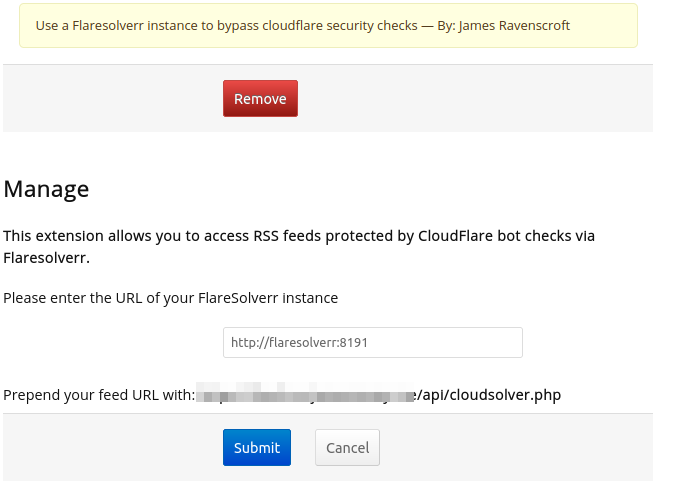

# FreshRSS Flaresolverr Extension

FreshRSS plugin that provides cloudflare puzzle solving via flaresolverr

## Why

Some popular publishing sites, including [substack](https://substack.com/) use [Cloudflare](https://www.cloudflare.com/) to provide content caching and DDoS protection. 

If cloudflare suspects that your machine is a bot, they throw up a [challenge](https://developers.cloudflare.com/fundamentals/get-started/concepts/cloudflare-challenges/) - this is normally just a page that requires your browser to run some javascript which filters out simple scrapers that don't evaluate scripts. This means that Freshrss sometimes fails to retrieve feeds protected by cloudflare and it isn't "smart" enough to pass these cloudflare filters on its own.

This FreshRSS extension uses [Flaresolverr](https://github.com/FlareSolverr/FlareSolverr/) to start a headless browser (essentially a full copy of chrome or firefox but without a UI to look at) to parse and resolve these challenges and send the contents of an RSS feed through to FreshRSS as normal.

## Install

### Set up FlareSolverr
You will need an instance of FlareSolverr running somewhere that is accessible to your FreshRSS instance. If you are using Docker Compose to manage FreshRSS then you can add FlareSolverr to your compose file. an example docker-compose file can be found [here](./docker-compose.example.yml).

### Install the Plugin

1. Copy this whole directory to your FreshRSS `extensions` directory.
2. Paste in the URL of your FlareSolverr instance in the settings window

3. Copy the feed URL in bold

### Configure your Feeds

Prepend any feeds protected by Cloudflare with the URL. For example if your freshrss instance is at https://freshrss.example.com/ and you want to subscribe Sebastian Ruder's excellent NLP newsletter [https://nlpnewsletter.substack.com/](https://nlpnewsletter.substack.com/), you would take the full URL to the RSS feed `https://nlpnewsletter.substack.com/feed` and set the feed url in FreshRSS to:

`https://freshrss.example.com/api/cloudsolver.php?feed=[https:/](https://nlpnewsletter.substack.com/feed)https://nlpnewsletter.substack.com/feed
